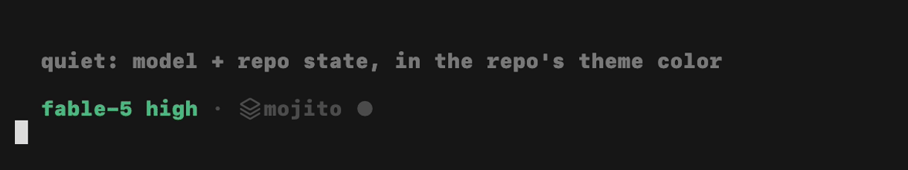

# quota-router

[](https://github.com/wr/quota-router/actions/workflows/test.yml)

Run Claude Code and OpenAI Codex together without babysitting either quota.



You pay for two AI subscriptions. Each has its own rate windows, neither tool
can see the other's, and the model deciding where your subagents run can't see
either. quota-router fixes the three ways that bites you:

- **A status line that stays out of the way.** Model, repo, and git state
  (branch, dirty, PR in review, checks green) in your repo's own theme color —
  and nothing else, until a provider crosses 75%, when both pools' numbers
  appear with a reset countdown, yellow first, red past the gate. (Prefer
  always-on gauges? Braille and circle styles are one config key away.)
- **Work lands where the headroom is.** Every subagent launch gets the live
  numbers injected at decision time, and a routing policy puts the work where
  it fits: protect the weekly cap (the one that ruins your week), drop a tier
  or offload to Codex as the 5-hour window fills, rein in parallel fan-out
  when quota is tight.
- **Sessions outlive the cap.** Hit the 5-hour limit mid-task and, with
  hibernate on, the session waits out the reset and resumes itself — you come
  back to finished work instead of a stopped prompt.
- **Nothing creepy.** No proxy, no API keys, no telemetry. Two read-only
  probes over files already on your disk, ~1,200 lines of stdlib Python,
  self-tested in CI.

## Install

Claude Code on a subscription plan, python3, macOS or Linux. The Codex CLI is
optional — without it the Codex half just reads `--`.

```sh
git clone https://github.com/wr/quota-router
cd quota-router && ./install.sh
```

Restart Claude Code (or open `/hooks` once). The installer backs up
`settings.json`, wraps any status line you already have instead of replacing
it, and never overwrites your config on re-runs. `./uninstall.sh` puts
everything back the way it was.

Preview all the looks in your own terminal:

```sh
python3 ~/.claude/quota-router/statusline.py --demo
```

## Make it yours

Thresholds, status-line style (`minimal` / `braille` / `circles` / `plain`),
and hibernate live in `~/.claude/quota-router/config.json`. The accent color
follows your Claude Code theme per repo (custom themes' `overrides.claude`),
with env-var and config overrides when you want something else. The model tier tables
live in the skill and name the models my plans expose — edit them to match
yours; the gates don't care what the tiers are called. Hibernate is off by
default because a script that types into your terminal should be something
you chose: flip `hibernate_enabled` when you want it.

## How it works

Two read-only probes (Claude's numbers from the status-line payload it
already pushes, Codex's from its rollout logs) feed a cache; a PreToolUse
hook injects the snapshot at every subagent launch; a skill turns it into
provider / model / effort / fan-out decisions; a Stop-hook + watchdog pair
handles hibernation. The full mechanics — the routing policy, the hibernate
design, and the limitations stated plainly — are in
**[docs/HOW-IT-WORKS.md](docs/HOW-IT-WORKS.md)**.

## License

[MIT](LICENSE)
