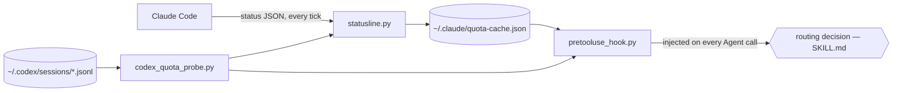

# quota-router

[](https://github.com/wr/quota-router/actions/workflows/test.yml)

Live quota routing between Claude Code and OpenAI Codex.

```
Claude 5h 64% / 7d 71% · Codex 5h 12% wk 19%
```

If you pay for both Claude and ChatGPT, you have two separate rate-limit pools
and no tool that can see both at once. quota-router puts both readouts in your
Claude Code status line, injects them at the moment you're about to launch a
subagent, and ships the routing policy that decides where work should run.
Three small Python scripts (stdlib only) and one skill. It doesn't proxy
traffic, take API keys, or collect anything — the probes read files that are
already on your disk.

## Why bother

Three things make this worth automating instead of eyeballing:

**Every Claude subagent draws from the same pool.** A three-way parallel
fan-out isn't extra capacity — it's your 5-hour window draining three times
faster. The only lever that adds real capacity is the other provider.

**The weekly window is the one that hurts.** The 5-hour window heals itself
while you eat lunch. Hit the 7-day cap on a Wednesday and you're rationing
until reset. The two windows need different policies, and most people (and
models) treat them as one number.

**The model making delegation decisions can't see quota.** Claude will happily
fan out five Opus subagents at 88% weekly usage, because nothing told it. A
skill it might remember to consult isn't enough; the numbers have to show up
unprompted, at decision time. That's what the hook is for.

## How it works



| File | Role |
|---|---|
| `router/statusline.py` | Claude Code pipes status JSON (including `rate_limits`) to the status-line script on every tick. This caches those numbers and renders the readout. If you already had a status line, it gets wrapped, not replaced. |
| `router/codex_quota_probe.py` | Reads the newest `token_count` event from Codex's rollout logs. Read-only: never launches Codex, never spends a token. |
| `router/pretooluse_hook.py` | A `PreToolUse` hook on `Agent` calls. Injects the live snapshot as context every time a subagent is about to launch, whether or not anyone remembered to check. |
| `skill/SKILL.md` | The policy. Classify the task, gate each window on quota, pick provider, model, effort, and fan-out. |

In the readout, `!` marks a binding window (with a reset countdown), `~` means
the number is stale, `--` means unknown:

```
Claude 5h 88%!(34m) / 7d 71% · Codex wk 19%
```

## Install

Requirements: Claude Code on a subscription plan (that's where the
`rate_limits` payload comes from), python3, macOS or Linux. The Codex CLI is
optional — without it the readout shows `Codex --` and the policy simply never
routes there.

```sh
git clone https://github.com/wr/quota-router
cd quota-router
./install.sh
```

Then restart Claude Code (or open `/hooks` once). The Claude side reads `--`
until the first API response of a fresh session populates the cache; that's
normal.

The installer is transparent about what it touches: it copies the three
scripts to `~/.claude/quota-router/`, installs the skill to
`~/.claude/skills/subagent-router/`, and registers the status line and hook in
`~/.claude/settings.json` after writing a timestamped backup. Re-running it is
safe — it never overwrites your `config.json`, and it records a pre-existing
status line so it can be wrapped now and restored on uninstall.

## The policy, in short

The full decision procedure lives in [`skill/SKILL.md`](skill/SKILL.md). The
load-bearing ideas:

- **Quota is a hard gate; model strength only breaks ties.**
- **Windows are gated separately**, never collapsed into one number. Weekly
  above 75%: protect hard — offload to Codex, drop the frontier tier, fan-out 1.
  The 5-hour window above 85% (counting a per-tier launch reserve): drop a
  tier, wait if the reset is minutes away, otherwise offload.
- **Unknown is not 0%.** A stale snapshot or a rolled-over window means "don't
  route on this", never "free headroom".
- **Reset proximity decides wait-vs-switch.** It never discounts the capacity
  check itself.
- **Adversarial review crosses providers.** Whichever model wrote the thing
  doesn't get to review it.
- **On a 429**, mark that provider binding, retry once on the other at the same
  or cheaper tier, then stop. No retry loops, no post-429 fan-out.

## Tuning

Thresholds live in `~/.claude/quota-router/config.json`:

| Key | Default | Meaning |
|---|---|---|
| `weekly_protect_pct` | 75 | 7-day usage above this → protect mode |
| `fivehour_soft_pct` | 85 | 5-hour usage + launch reserve above this → constrained |
| `claude_cache_ttl_seconds` | 90 | Claude numbers older than this (and absent from the latest tick) count as stale |
| `codex_old_snapshot_seconds` | 1800 | Codex snapshots older than this get the `~` marker |
| `fable_available_on_plan` | false | Set true only if a promo/frontier model actually shows in your model selector; gates the top Claude tier |
| `test_override` | null | Short-lived fake quota values for dry-running the routing policy |

The tier tables in the skill name the models my two plans expose today
(Opus/Sonnet/Haiku on the Claude side, gpt-5.6-sol and codex-spark on the
Codex side). Edit them to match yours — the gates don't care what the tiers
are called.

## Limitations, honestly

- **Claude numbers come from the status-line payload.** Claude Code pushes
  `rate_limits` there on subscription plans; if yours doesn't, the Claude side
  stays `--` and only the Codex half is useful.
- **Codex numbers are as fresh as your last Codex run.** The probe reads
  rollout logs; it refuses to guess past a window reset, so after a few idle
  days Codex reads "unknown" even though it's probably sitting at 0%. One
  trivial Codex run refreshes it.
- **The per-tier reserves are eyeballed**, not billing data. They're routing
  buffers; expect to nudge them for your usage patterns.
- **The hook is advisory.** It puts the numbers in front of the model at
  decision time, and the skill tells it what to do with them — but nothing
  hard-blocks a delegation. In practice the model follows numbers it can see;
  this is a well-informed habit, not an enforcement layer.
- **Both payload formats are undocumented.** Claude Code's `rate_limits` shape
  and Codex's rollout events could change in any release. The scripts fail
  toward "unknown", never toward a crash in your status line, but a format
  change will blank the readout until updated.

## Where this came from

It was built in one Claude Code session and adversarially reviewed across the
fence: Claude (Opus) wrote the plan, GPT reviewed it and found six real bugs
before anything shipped — among them windows collapsed with `max()` (destroying
the weekly/5-hour distinction) and rolled-over snapshots being read as 0% used.
The skill's cross-provider review rule automates the loop that built it.

The paranoia about background Codex runs is also earned. An unbounded
"go plan this" run once hung for an hour on a broker bug, which is why the
skill insists on the companion broker path, explicit time/evidence budgets,
and a watchdog instead of waiting forever.

## Uninstall

```sh
./uninstall.sh
```

Restores your previous status line if one was wrapped, removes the hook and
all installed files, and backs up `settings.json` first.

## License

[MIT](LICENSE)
