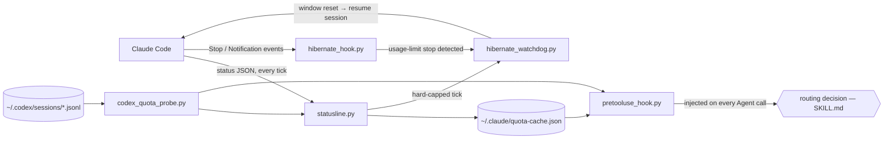

# How it works

The README covers what you get; this covers how, and where the sharp edges
are.

## Why this needs to exist

**Every Claude subagent draws from the same pool.** A three-way parallel
fan-out isn't extra capacity — it's your 5-hour window draining three times
faster. The only lever that adds real capacity is the other provider.

**The weekly window is the one that hurts.** The 5-hour window heals itself
while you eat lunch. Hit the 7-day cap on a Wednesday and you're rationing
until reset. The two windows need different policies, and most people (and
models) treat them as one number.

**The model making delegation decisions can't see quota.** Claude will happily
fan out five Opus subagents at 88% weekly usage, because nothing told it. A
skill it might remember to consult isn't enough; the numbers have to show up
unprompted, at decision time. That's what the hook is for.

## The pieces



| File | Role |
|---|---|
| `router/statusline.py` | Claude Code pipes status JSON (including `rate_limits`) to the status-line script on every tick. This caches those numbers and renders the readout. If you already had a status line, it gets wrapped, not replaced. |
| `router/codex_quota_probe.py` | Reads the newest `token_count` event from Codex's rollout logs. Read-only: never launches Codex, never spends a token. |
| `router/pretooluse_hook.py` | A `PreToolUse` hook on `Agent` calls. Injects the live snapshot as context every time a subagent is about to launch, whether or not anyone remembered to check. |
| `router/hibernate_hook.py` | Stop/Notification hook. Detects a usage-limit stop (and logs every event it sees, since the exact cap-event shape is undocumented), then arms the watchdog. |
| `router/hibernate_watchdog.py` | Waits out the window reset, then resumes the interrupted session — by typing into the original tmux pane, or `claude --resume` as a fallback. |
| `skill/SKILL.md` | The policy. Classify the task, gate each window on quota, pick provider, model, effort, and fan-out. |

Every script has a `--self-test`; CI runs them all.

## Reading the readout

The default style is `minimal` — quota is invisible until it matters:

```
􀐞 repo 􀜞 main · opus-4.8 high                                  (all quiet)
􀐞 repo 􀜞 main · opus-4.8 high 76% (2h10m) · codex 82% (2h42m)  (constrained)
```

- The place segment leads, in the repo's theme accent color: the repo and its
  git state: `􀐞 repo 􀜞` (repo icon, then a state symbol —
  main/clean, main/modified `􀧙`, branch/clean `􀣽` + branch name,
  branch/modified `􀫲`, PR in review `􀩄`, PR checks green `􀁣`). When a PR
  exists, the branch name is followed by `#N` — an OSC 8 hyperlink to the PR
  in terminals that support it. PR state is cached for 3 minutes and
  refreshed by a detached background `gh` call, so ticks never wait on the
  network. Outside a git repo it's the ~-shortened
  path. The symbols are SF Symbols (macOS); on other platforms — or with
  `statusline_git_symbols: "ascii"` — a plain unicode set is used.
- Model + effort (the session's, and each running subagent's) are color-coded
  by effort: low yellow, medium green, high light purple, xhigh purple, and
  max renders as a rainbow gradient that shimmers as the statusline repaints.
  Separators and the codex label are gray.
- Below `statusline_show_pct` (default 75) on both providers: no numbers at
  all. The moment either crosses it, both providers' most-pressured windows
  appear — your usage and the alternative, in one glance.
- Percentages go yellow at the show threshold, red + bold past the window's
  own gate (85% for 5-hour windows, 75% for weekly).
- The countdown appears when the reset is near enough to be actionable
  (within 8 hours) — a weekly window days from reset shows just the number.
- `~` means the number is stale; `--` means unknown.
- A leading `⏾` means a capped session is hibernating.
- Running subagents appear last, as numbered badges with model + effort,
  the whole chunk painted in the agent's effort color (a max agent's
  rainbow spans its badge too): `􀃋 sonnet high  􀃍 sol xhigh`. Claude launches are tracked by the Agent-tool
  hooks (PreToolUse registers, PostToolUse/SubagentStop/SessionEnd clean up,
  a 2-hour TTL scrubs crash leftovers); Codex runs are detected from rollout
  files written in the last two minutes, with model and effort read from the
  file tail. Both sources are shared across every open Claude Code instance,
  so each instance shows only its own agents: Claude entries are matched by
  session id, Codex runs by the rollout's recorded cwd against the session's
  cwd (same directory or one inside the other). When either side of a match
  is unknown, the badge stays visible rather than silently vanishing. Claude agents that don't set an explicit model show the session
  model; their effort label is the session effort (agent definitions can
  override effort invisibly). Codex entries linger up to ~2 minutes after a
  run finishes.

The always-on gauge styles (`statusline_style: braille`, `circles`, or
`plain`) show every window all the time instead:

```
Claude 5h ⣿88%!(34m) / 7d ⣧71% · Codex wk ⡄19%
```

Every style also shows the session's context usage — `238.9k (24%)`, taken
straight from the payload's `context_window` block — docked to the right
edge of the row (Claude Code exports `COLUMNS` to statusline scripts since
v2.1.153; without it the readout is appended as one more segment). `COLUMNS`
is the raw terminal width and the row renders inside Claude Code's UI
chrome, so the dock stops `statusline_context_margin` columns short of it
(default 4) — if the readout still gets ellipsis-truncated on your setup,
raise the margin; if it floats left of the edge, lower it. Gray normally,
yellow from 80%, red from 95% — display only, nothing routes on it. On
ticks where Claude Code reports no usage (session start, right after
`/compact`) the readout is omitted rather than shown as zero.

Run `statusline.py --demo` to see the styles rendered in your own terminal.

## The routing policy, in short

The full decision procedure lives in [`skill/SKILL.md`](../skill/SKILL.md).
The load-bearing ideas:

- **Orchestrate, don't execute.** The main session's own turns are the most
  expensive spend (frontier model × full context × every turn), so the policy
  is aggressive delegation: implementation, searches, test runs, and
  mechanical edits go to cheaper agents; the orchestrator keeps judgment,
  review, and synthesis.
- **Quota is a hard gate; model strength only breaks ties.**
- **Windows are gated separately**, never collapsed into one number. Weekly
  above 75%: protect hard — offload to Codex, drop the frontier tier,
  fan-out 1. The 5-hour window above 85% (counting a per-tier launch
  reserve): drop a tier, wait if the reset is minutes away, otherwise
  offload.
- **Delegation targets shift before the gates trip.** From
  `fivehour_conserve_pct` (default 50) upward, standard and mechanical
  delegations default to Codex or Haiku, saving the Claude window for what
  needs Claude — so the hard thresholds rarely get reached at all.
- **Unknown is not 0%.** A stale snapshot or a rolled-over window means
  "don't route on this", never "free headroom".
- **Reset proximity decides wait-vs-switch.** It never discounts the capacity
  check itself.
- **Adversarial review crosses providers.** Whichever model wrote the thing
  doesn't get to review it.
- **On a 429**, mark that provider binding, retry once on the other at the
  same or cheaper tier, then stop. No retry loops, no post-429 fan-out.

## Hibernate: surviving the 5-hour cap

Claude Code has no native "wait for the limit to reset and keep going" — when
the window caps out, the session stops and waits for you. With
`hibernate_enabled: true`, quota-router babysits instead:

1. Two triggers spot the cap, both gated on the quota cache. A
   Stop/Notification hook arms when an event arrives while a window sits
   at/above `hibernate_arm_pct` (default 99.5) with a future reset — Claude
   Code's limit banner never reaches hooks (verified in the field), but the
   cache reads 100% at cap. A limit-looking message in the event text also
   arms, when one ever shows up. And the statusline arms on the same
   condition from its own tick, because a session that caps out while
   sitting idle produces no hook events at all: a `/loop` scheduled wakeup
   that gets rejected by the limit dies silently (also verified in the
   field), while the statusline keeps ticking through it. Either way the
   cache must confirm real pressure, so a session merely *talking about*
   limits can't trigger it.
2. It writes a hibernation marker (session id, tmux pane, reset time — which
   the cache already knows) and spawns a detached watchdog. The statusline
   shows `⏾`.
3. At reset + a settle delay, the watchdog resumes the session: it types a
   continue prompt into the original tmux pane if it's still alive (your
   visible session just picks back up), else falls back to
   `claude --resume <session-id> -p`. The headless fallback gets a stronger
   prompt: a `-p` run exits when the turn ends, so the session is told it is
   one-shot and must not end its turn waiting on background tasks or
   notifications — nothing can bring it back (a session once stalled exactly
   that way, ending its resumed turn with "the completion notification will
   bring me back").

Messages you send while capped are covered too: each one fires a Stop event
that arms hibernation if nothing had yet, and the resume prompt tells the
session to answer anything you left before continuing its task.

`hibernate_watchdog.py --status` shows what's armed, `--disarm` cancels,
`--dry-run` previews what a firing would do.

## Config reference

`~/.claude/quota-router/config.json`:

| Key | Default | Meaning |
|---|---|---|
| `weekly_protect_pct` | 75 | 7-day usage above this → protect mode |
| `fivehour_soft_pct` | 85 | 5-hour usage + launch reserve above this → constrained |
| `fivehour_conserve_pct` | 50 | above this, standard/mechanical delegations default to Codex/Haiku |
| `claude_cache_ttl_seconds` | 90 | Claude numbers older than this (and absent from the latest tick) count as stale |
| `codex_old_snapshot_seconds` | 1800 | Codex snapshots older than this get the `~` marker |
| `statusline_style` | minimal | `minimal`, `braille`, `circles`, or `plain` |
| `statusline_color` | true | ANSI colors on the readout |
| `statusline_show_pct` | 75 | minimal style: hide quota below this, show both providers at it |
| `statusline_git_symbols` | auto | `auto` (SF Symbols on macOS, unicode elsewhere), `sf`, or `ascii` |
| `statusline_context_margin` | 4 | columns held back from `COLUMNS` when docking the context readout; raise if it truncates, lower if it floats left of the edge |
| `statusline_accent` | #D97757 | minimal style: fallback hex for the model name. Per repo it auto-follows a custom Claude Code theme (`"theme": "custom:<name>"` in the project's `.claude` settings → `~/.claude/themes/<name>.json` `overrides.claude`); an explicit `statusline_accent` key in project settings or a `STATUSLINE_ACCENT` env var overrides the theme |
| `hibernate_enabled` | false | Opt-in auto-resume after a usage-limit stop |
| `hibernate_arm_pct` | 99.5 | A window at/above this with a future reset counts as hard-capped |
| `hibernate_settle_seconds` | 90 | Extra wait past the reset before resuming |
| `hibernate_max_wait_hours` | 12 | Never hibernate longer than this |
| `fable_available_on_plan` | false | Set true only if a promo/frontier model actually shows in your model selector; gates the top Claude tier |
| `fable_weekly_fraction` | 0.5 | Fable's weekly sub-limit as a fraction of the account's 7-day window, used to estimate Fable usage (see below). Must be a number in (0, 1]; anything else falls back to 0.5 |
| `fable_weekly_protect_pct` | 80 | Estimated Fable weekly usage above this → binding signal: no Fable-tier subagent launches |
| `test_override` | null | Short-lived fake quota values for dry-running the routing policy |

Claude's Fable model has its own weekly sub-limit, and it's not exposed
anywhere in the status payload — only `five_hour` and `seven_day` show up.
So when `fable_available_on_plan` is on, the PreToolUse hook estimates it
instead (it deliberately stays out of the statusline — a worst-case ceiling
parked at ~100% all week reads as a constant alarm): 7-day usage divided by
`fable_weekly_fraction` (default 0.5, i.e. Fable's sub-limit is roughly half
the account's 7-day window), capped at 100%. It's a worst-case number, not a
reading — any non-Fable usage during the week inflates the estimate, which
is the safe direction for something meant to stop you from blowing the
sub-limit before you notice. When the 7-day window itself is stale or
missing, the estimate is dropped entirely — unknown stays unknown, it's
never shown as a number just because the math would still run.

## Limitations, honestly

- **Claude numbers come from the status-line payload.** Claude Code pushes
  `rate_limits` there on subscription plans; if yours doesn't, the Claude
  side stays `--` and only the Codex half is useful. And an idle instance
  repaints with the numbers from its *last API response*, so the cache
  cross-checks window identity before accepting a tick: a payload whose
  reset already passed is dropped, and used% can't go down within one
  window (verified in the field — a stale repaint briefly showed 76% on a
  window that was really at 18%).
- **Codex numbers are as fresh as your last Codex run.** The probe reads
  rollout logs; it refuses to guess past a window reset, so after a few idle
  days Codex reads "unknown" even though it's probably sitting at 0%. One
  trivial Codex run refreshes it.
- **The per-tier reserves are eyeballed**, not billing data. They're routing
  buffers; expect to nudge them for your usage patterns.
- **The routing hook is advisory.** It puts the numbers in front of the model
  at decision time, and the skill tells it what to do with them — but nothing
  hard-blocks a delegation. In practice the model follows numbers it can see;
  this is a well-informed habit, not an enforcement layer.
- **Hibernate detection is regex-over-undocumented-events.** The exact event
  Claude Code emits at a cap isn't documented, so the hook logs everything it
  sees to `events.log` — if your first real cap slips past the detection, the
  log is exactly what's needed to fix it.
- **Statusline arming resumes the session whose tick saw the cap.** The cap
  is account-wide but the marker is single-shot: with several sessions open,
  whichever statusline ticks first past the threshold is the one the
  watchdog resumes. And if the only capped session's statusline stops
  ticking while it's idle, nothing arms until some session ticks.
- **Both payload formats are undocumented** and could change in any release.
  The scripts fail toward "unknown", never toward a crash in your status
  line, but a format change will blank the readout until updated.

## Where this came from

It was built in one Claude Code session and adversarially reviewed across the
fence: Claude (Opus) wrote the plan, GPT reviewed it and found six real bugs
before anything shipped — among them windows collapsed with `max()`
(destroying the weekly/5-hour distinction) and rolled-over snapshots being
read as 0% used. The skill's cross-provider review rule automates the loop
that built it.

The paranoia about background Codex runs is also earned. An unbounded
"go plan this" run once hung for an hour on a broker bug, which is why the
skill insists on the companion broker path, explicit time/evidence budgets,
and a watchdog instead of waiting forever.
